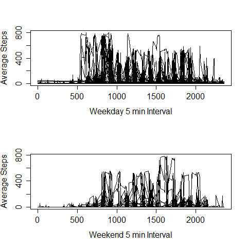

## Loading and preprocessing the data
```{r eval=FALSE}
fname <- "activity.csv"
raw <- read.csv(fname, stringsAsFactors=FALSE)
```

* steps: Number of steps taking in a 5-minute interval (missing values are coded as NA)
* date: The date on which the measurement was taken in YYYY-MM-DD format
* interval: Identifier for the 5-minute interval in which measurement was taken

*  17568 == 2 months or 61 days * 288 readings per day
*  (24 hrs/day * 60 min/hr)/5 min = 288,  5 minute intervals per 24 hr day
*  Therefore there are 288 readings per day * 61 days (Oct and Nov) == 17568

Validate date range
```{r eval=FALSE}
range(raw$date) # 10-1 thru 11-31
```

Count days in each month
```{r eval=FALSE}
dom <- unique(as.Date(raw$date,"%Y-%m-%d")); dom
length(dom) #61 days
```

Readings per day
```{r eval=FALSE}
table(raw$date)
```

Every 5 min interval, exists across all 61 days
```{r eval=FALSE}
table(raw$interval)
```

How many missing step values"
```{r eval=FALSE}
sum(is.na(raw$steps)) # 2304 NAs
dim(raw[raw$steps==0,]) # 13318
```

Convert date to Date type
```{r eval=FALSE}
class(raw$date)
raw$date <- as.Date(raw$date,"%Y-%m-%d")
class(raw$date)
```

Remove NAs
```{r eval=FALSE}
data <- raw[!is.na(raw$steps),]
data
dim(data) # 15264   [17568-2304==15264]
```

Count days after removing NAs
```{r eval=FALSE}
dom <- unique(as.Date(data$date,"%Y-%m-%d")); dom
length(dom) #53 days
```

Convert date to a factor
```{r eval=FALSE}
data$date <- factor(data$date)
```

## What is mean total number of steps taken per day (ignoring NAs)?
* Total steps: 57,0608
* Total days: 53
* Mean total steps: 10766.19
* Median steps: 10765

```{r eval=FALSE}
sum(data$steps) 
steps_per_day <- aggregate(data$steps, list(data$date), sum)
sum(steps_per_day$x) 
mean(steps_per_day$x) 
```

# Histogram
 


## What is the average daily activity pattern?
* average number of steps taken for each 5 min. interval across all days
* time series plot of this result
* which interval has the highest average steps?

```{r eval=FALSE}
datainterval<-(aggregate(data[,1], by=list(data$interval), mean))
names(datainterval)<- c("interval","avgsteps")
```

 

Interval 835 has the highest average steps at 206.17
```{r eval=FALSE}
datainterval[datainterval$avgsteps==max(datainterval$avgsteps),]
```


## Imputing missing values
* report the total number of missing values in the dataset
* fill missing step values by inserting into each NA the related average steps for that interval
* create a histogram with the filled values dataset
* calculate total steps, mean and median using the new filled dataset

Missing step values
```{r eval=FALSE}
sum(is.na(raw$steps)) # 2304 NAs
```

Fill missing vaues
```{r eval=FALSE}
datafillNAs <- raw # create df with NAs
names(datainterval)<- c("interval","avgsteps")
for(i in which(is.na(datafillNAs$steps)==TRUE)){
    datafillNAs[i,"steps"] <- datainterval[datainterval$interval==datafillNAs[i,"interval"],"avgsteps"]
}
```

Histogram of filled data
 

Calculate values for filled dataset to comparewith missing values dataset
* Total steps: 656737.5
```{r eval=FALSE}
data_filledstepsEachDay <- tapply(datafillNAs$steps, datafillNAs$date, FUN=sum)
sum(data_filledstepsEachDay) 
```

* Mean: 10766.19
```{r eval=FALSE}
mean(data_filledstepsEachDay)
```

* Median: 10766.19
```{r eval=FALSE}
median(data_filledstepsEachDay)
```

* Sum difference is 656,737 - 570,608 = 86,129
* Mean difference is 10,766 - 10,766 = 0
* Median difference is 10,766 - 10,766 = 0

# Do these values differ from the estimates from the first part of the assignment? 
* Only the total steps differs

# What is the impact of imputing missing data on the estimates of the total daily number of steps?
* 2,300 missing values out of 17,568 records is 13% missing values. Step values with zero were 13,318. So 13,318/17,568=75.8% of the step values were zero.
Since there were a larger number of 0 values the missing values didn`t have any impact on the mean and median 


## Are there differences in activity patterns between weekdays and weekends?
* create subsets of weekday and weekend data
* create factor variable in the dataset with two levels – “weekday” and “weekend”
* panel plot a time series for the 5-minute interval and average number of steps (across all weekday days or weekend days)

Subsets by weekend and weekday and plotted for comparison
```{r eval=FALSE}
data_weekday<- tapply(datafillNAs[weekdays(datafillNAs$date)!="Saturday"&weekdays(datafillNAs$date)!="Sunday","steps"], datafillNAs[weekdays(datafillNAs$date)!="Saturday"&weekdays(datafillNAs$date)!="Sunday","date"],FUN=mean)
data_weekend<- tapply(datafillNAs[weekdays(datafillNAs$date)=="Saturday"|weekdays(datafillNAs$date)=="Sunday","steps"], datafillNAs[weekdays(datafillNAs$date)=="Saturday"|weekdays(datafillNAs$date)=="Sunday","date"],FUN=mean)

par(mfrow=c(2,1))
hist(data_weekday,breaks=30)
hist(data_weekend,breaks=30)
```

* Weekdays have higher activity with a considerable peak earlier in the day
 

Factor for weekday and weekend
```{r eval=FALSE}
wkDay <- c('Monday','Tuesday','Wednesday','Thursday','Friday')
datafillNAs$WD_WE <- factor((weekdays(datafillNAs$date) %in% wkDay), levels=c(FALSE,TRUE), labels=c('weekend','weekday'))
```
 
Panel plot time series for weekend and weekday data
```{r eval=FALSE}
par(mfrow=c(2,1))
plot(datafillNAs[datafillNAs$WD_WE=="weekday","interval"], datafillNAs[datafillNAs$WD_WE=="weekday","steps"],
     type="l",
     xlab="5 min Interval",
     ylab="Average Steps"
)
plot(datafillNAs[datafillNAs$WD_WE=="weekend","interval"], datafillNAs[datafillNAs$WD_WE=="weekend","steps"],
     type="l",
     xlab="5 min Interval",
     ylab="Average Steps"
)
```

* Weekdays have higher activity with a considerable peak earlier in the day
 
